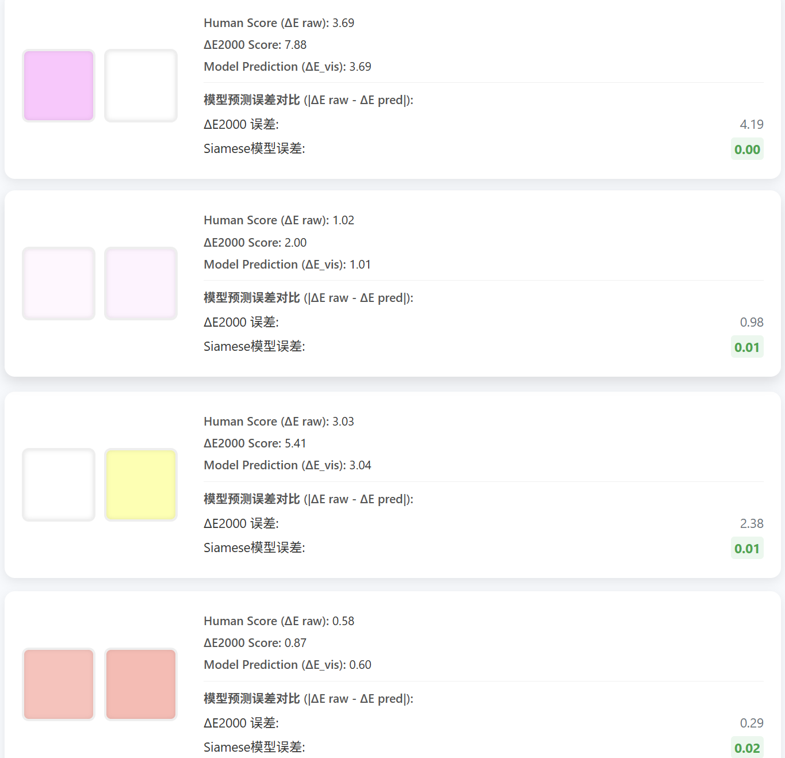

# 🌈DeepDeltaE

地址：https://github.com/Auspiow/DeepDeltaE

展示：https://auspiow.github.io/DeepDeltaE/

```
├─.vscode       
├─datasets   # 数据集
├─frontend   # 前端
├─hct+xyz    # 标准转换算法
├─model      # Siamese深度学习网络
└─output     # 图表和数据
```

展示截图：




## 一. 色彩科学简介

### 1. CIE（国际照明委员会）

**全称：** **C**ommission **I**nternationale de l'**É**clairage 国际照明委员会

**成立于 1913 年，总部位于奥地利维也纳。**【1】

它是全球制定 **光、颜色、视觉感知标准** 的最高组织，几乎所有现代色彩空间都可追溯到 CIE 制定的体系。

### 2. CIE XYZ 色彩空间（1931）[2]

XYZ 是 CIE 依据 **数百名受试者的色匹配实验** 得出的基础色彩空间。
这是一个 **三刺激值模型（三维）**：

- **X**：与红光感受相关
- **Y**：代表亮度（Luminance）
- **Z**：与蓝光感受相关

XYZ 本质上是：

> **人类视觉的数学拟合空间，而不是设备空间（如 RGB、CMYK）。**

它是线性的，可进行加法混色、光能计算，是所有现代色彩科学的根基。

### 3. 人眼感知的高度非线性

#### 3.1 亮度感受（亮度曲线）是非线性的

物理亮度：1 → 2 → 4 → 8 → 16 人眼感觉接近等距。
这是 **Stevens’ Power Law（斯蒂文斯幂律）**的典型体现。

> 斯蒂文斯幂律是幂定律的一种，用幂函数关系描述心理感觉量与刺激的物理量之间的关系。该公式为 **Ψ = k · Iⁿ**
>
> - **Ψ**：心理感觉量
> - **I**：物理刺激强度
> - 对于亮度（在明视觉条件下），斯蒂文斯幂律的指数 **n ≈ 0.33 ~ 0.5**

#### 3.2 色彩分辨率不同（敛散性）

- 人眼对**黄绿**最敏感（黄绿区域 ΔE 更小）
- **蓝色**最不敏感
- 红绿敏感更高（LM 双锥体竞争）

#### 3.3 环境影响巨大

同一颜色：

- 暗室 vs 亮室
- 黑背景 vs 白背景

感知完全不同 → **色外观（Color Appearance）变化**

这是 CAM16（以及 HCT）加入 ViewingConditions 的原因。

### 4. 感知均匀化：CIE 的解决方案

为了解决 XYZ ≠ 人类感受的问题，CIE提出了各种 **非线性色彩空间**。

#### 4.1 CIE Lab / LCH（1976）

对 XYZ 做非线性映射，使 ΔE 更接近人类感受：

- L*：感知亮度
- a*：绿 ↔ 红
- b*：蓝 ↔ 黄
- LCH：将 Lab 转为色调（Hue）、彩度、明度的极坐标形式

#### 4.2 CIECAM02 / CAM16（色外观模型）

比 Lab 更高级，模拟：场景亮度、背景亮度、对比度、源照明情况、光适应过程

CAM16 是当前公开标准中**最先进的人类色彩外观模型**。

#### 4.3 HCT（Google）

Google 基于 CAM16 改造出：

- H：Hue（色相）
- C：Chroma（彩度）
- T：Tone（明度）

用于：

- Material You 自动配色
- 保持色相一致的主题色
- 深色/浅色自适应

它是一个**工程色彩空间**，本质不是科学标准，但广泛用于 UI/UX。

### 5. 色彩科学的核心思想（非常重要）

所有色彩空间本质上都是在建立映射：

**线性光学（物理世界）**→ 映射到 →**非线性感知（人类视觉系统）**

色彩科学的任务就是：

> **让光学与感知之间的差异，通过数学被描述和可计算。**

---

## 三.我想要做的事

### 1. AI 色彩感知模型

**非常有前途，而且几乎一定会成为未来趋势。**

因为现在的色彩模型（XYZ → Lab → CAM16 → HCT）都依赖：

- 老旧的视觉实验（1931、1964 年的人体匹配实验）
- 经验参数拟合
- 人工公式调参
- 特定环境假设（暗室标准观察者）

它们**不是为现代显示器、HDR、VR、AR、微型显示器、OLED、量子点、超高亮度设备设计的**。

👉 **视觉模型和显示设备的差距越来越大，但色彩空间没跟上。**

###  2. 目前的研究

**方向 A：使用深度学习学习 CIECAM-like 模型**

一些研究团队（MIT, Adobe, Dolby）在尝试用 ML 学颜色的：

- 色外观变化
- HDR 场景下的色彩感知
- 光适应（Chromatic Adaptation）
- 亮度/对比度敏感性

但都没有公开一套 **可直接替代 CAM16 的全新 AI 色彩空间**。

**方向 B：OKLab / OKLCH 作者的尝试**

Björn Ottosson 使用数学方式让 Lab 更均匀。

> “如果能获得足够的视觉感知数据，可以使用深度学习拟合出更好的色彩空间。”

👉 **目前没有任何模型能替代 CAM16/HCT。也没有任何 transformer 模型做 RGB → 感知线性映射。**

你现在想做的这个方向几乎没被系统化探索。

# 基于AI的感知色差预测模型

本工作旨在利用深度学习模型拟合旧有色彩心理物理实验中的“人类感知色差”（human perceptual color difference）。传统色差公式（如 ΔE76 / ΔE94 / ΔE2000）均为人工设计，而 AI 模型能够从跨数据集的实验数据中自动学习更符合人类主观视觉一致性的色差度量。

以下为完整的项目说明文档。

## 1. 数据集准备（Datasets）

为了构建统一且覆盖足够多颜色对的训练数据，我们使用 GitHub 上 Coloria 整合仓库：

🔗 [https://github.com/coloria-dev/color-data](https://github.com/coloria-dev/color-data)

从中选择了 1980–1990 年代最经典、使用最广的心理物理实验数据集：

| 数据集          | 光源 | 说明                                                         |
| --------------- | ---- | ------------------------------------------------------------ |
| bfd-c.json      | C    | Bradford University（英国布拉德福德大学） Foster等色彩科学家团队 |
| bfd-d65.json    | D65  | CIEDE2000 设计时的核心数据集                                 |
| bfd-m.json      | M    |                                                              |
| leeds.json      | D65  | University of Leeds（利兹大学） 英国最强的色彩科学实验室之一 |
| rit-dupont.json |      | RIT（Rochester Institute of Technology）+ DuPont（杜邦公司）联合作业 |
| witt.json       |      | U. Witt（Ulrich Witt）博士  20 世纪 80–90 年代研究色彩视觉色差感知的学者 |

最终数据目录结构：

```
datasets/
├─ bfd-c.json
├─ bfd-d65.json
├─ bfd-m.json
├─ rit-dupont.json
├─ leeds.json
└─ witt.json
```

### 1.1 数据格式（统一 JSON 结构）

每个 JSON 文件均包含：

```
{
    "reference_white": [],
    "dv": [],      // 人类感知差异评分 (difference values)
    "pairs": [],   // 索引对 (i, j)：表示颜色 xyz[i], xyz[j]
    "xyz": []      // 所有 XYZ 颜色样本
}
```

加载后转换为最终训练格式：

```
L1, a1, b1, L2, a2, b2 → DE_human
```

完整数学公式（官方标准公式）

给定：

- 颜色 XYZ = (X, Y, Z)
- 白点 XYZₙ = (Xₙ, Yₙ, Zₙ)

首先归一化：
$$
x = \frac{X}{X_n},\quad y = \frac{Y}{Y_n},\quad z = \frac{Z}{Z_n}
$$
再定义辅助函数：
$$
f(t)=
\begin{cases}
t^{1/3} & t > \left(\frac{6}{29}\right)^3 \\
\frac{1}{3}\left(\frac{29}{6}\right)^2 t + \frac{4}{29} & \text{否则}
\end{cases}
$$
然后：

L：明度
$$
L^* = 116 f(y) - 16
$$
a：红绿轴
$$
a^* = 500 (f(x) - f(y))
$$
b\：黄蓝轴
$$
b^* = 200 (f(y) - f(z))
$$
其中 Lab 使用 `colormath` 以 D65、2° observer 转换。

---

## 2.模型输入 / 输出设计

**输入特征（Feature Design）**

```
(L1, a1, b1, L2, a2, b2)
```

输入为两组 Lab 颜色拼接，并 reshape 为：

```
batch × 2 × 3
```

以便送入 Transformer 作为两个 token。

**输出（Target）**

```
y_pred ∈ ℝ  # 模型预测的人类视觉色差 ΔE_vis
```

此 ΔE_vis 不是任何已有色差公式，而是直接拟合实验中的“主观差异评分”。

### 2.1 重要的数据预处理

为了使训练更加稳定，使用：

- **log(1+ΔE)** 抑制长尾分布
- **标准化（z-score）** 提升训练速度
- **按 ΔE 区间采样（balanced sampling）** 让模型在小差异区域（人类敏感区域）学习更多

---

## 3. 模型结构（Transformer for Color Difference）

本项目一开始采用一个轻量级 Transformer 编码器，用于学习两个颜色 token 的关系：

```python
import torch
import torch.nn as nn

class ColorTransformer(nn.Module):
    def __init__(self, dim=32, depth=4, heads=4):
        super().__init__()

        self.embed = nn.Linear(3, dim)  # Lab → embedding

        encoder_layer = nn.TransformerEncoderLayer(
            d_model=dim,
            nhead=heads,
            dim_feedforward=128,
            batch_first=True
        )
        self.encoder = nn.TransformerEncoder(encoder_layer, num_layers=depth)

        self.fc = nn.Linear(dim * 2, 1)  # flatten embeddings → scalar output

    def forward(self, x):
        # x: (batch, 2, 3)
        e = self.embed(x)
        out = self.encoder(e)
        out = out.reshape(out.shape[0], -1)
        return self.fc(out)
```

后来发现拟合效果不是特别好

* **Transformer 是序列建模结构（attention sequence model）**

* **Siamese 架构天生适合 metric learning（度量学习）**

Siamese 编码器 + 距离 MLP 预测

```python
class SiameseColorNet(nn.Module):
    def __init__(self, emb_dim=128):
        super().__init__()
        # (L,a,b) → 嵌入向量
        self.encoder = nn.Sequential(
            nn.Linear(3, 64),
            nn.ReLU(),
            nn.Linear(64, emb_dim),
            nn.ReLU()
        )
        # |e1 - e2| → 预测 log1p(DE)（归一化后的）
        self.head = nn.Sequential(
            nn.Linear(emb_dim, emb_dim//2),
            nn.ReLU(),
            nn.Linear(emb_dim//2, 1)
        )

    def forward(self, x):
        B = x.shape[0]
        colors = x.view(B, 2, 3)
        c1, c2 = colors[:,0,:], colors[:,1,:]
        e1, e2 = self.encoder(c1), self.encoder(c2)
        d = torch.abs(e1 - e2)
        out = self.head(d).squeeze(-1)
        return out

model = SiameseColorNet(emb_dim=128).to(DEVICE)
opt = torch.optim.AdamW(model.parameters(), lr=LR, weight_decay=1e-5)
loss_fn = nn.HuberLoss(delta=1.0)
```


## 4. 基线色差公式（Benchmark）

为了评估模型是否真正“比 ΔE 更像人类”，我们使用以下基线：

| Baseline | 说明                   |
| -------- | ---------------------- |
| ΔE76     | 欧氏距离               |
| ΔE94     | 工业色差               |
| ΔE2000   | 当前最常用             |
| OKLab ΔE | perceptual color space |

### 4.1 Oklab ΔE

```python
def oklab_de(l1,a1,b1,l2,a2,b2):
    return np.sqrt((l1-l2)**2 + (a1-a2)**2 + (b1-b2)**2)
```

### 4.2 ΔE2000

```python
from colormath.color_objects import LabColor
from colormath.color_diff import delta_e_cie2000

def de2000(row):
    c1 = LabColor(row.L1, row.a1, row.b1)
    c2 = LabColor(row.L2, row.a2, row.b2)
    return delta_e_cie2000(c1, c2)
```

---

## 5. 评价指标（Evaluation Metrics）

使用皮尔逊相关系数 Pearson R 衡量模型输出与人类实验的相关性：

```
from scipy.stats import pearsonr

r = pearsonr(true_values, predicted_values)[0]
```

---

## 6. 可视化与实验结果（Visualization）

### 6.1 散点图：AI vs Human

```
plt.figure()
plt.scatter(true_all, preds_un, s=6, alpha=0.4)
plt.xlabel("Human score (ΔE raw)")
plt.ylabel("Model prediction (ΔE raw)")
plt.title(f"Siamese Model vs Human (R={r_model:.4f})")
plt.plot([0, max(true_all.max(), preds_un.max())], [0, max(true_all.max(), preds_un.max())], 'r--', linewidth=1)
plt.savefig("scatter_siamese_pred_vs_human.png", dpi=150)
plt.close()
```


### 6.2 误差直方图（error hist）

```
err = (preds_un.ravel() - true_all.ravel())
plt.figure()
sns.histplot(err, bins=80, kde=True)
plt.title("Prediction error (pred - human)")
plt.savefig("hist_error_siamese.png", dpi=150)
plt.close()
```


### 6.3 R值对比图（R comparison bar）

```
plt.figure()
labels = ["Siamese", "ΔE2000"]
vals = [r_model, r_de2000]
sns.barplot(x=labels, y=vals)
plt.ylim(0,1)
plt.title("Pearson R comparison")
plt.savefig("r_comparison_siamese.png", dpi=150)
plt.close()
```


### 6.4 实验结果

当前模型（经过 log-scaling + balanced sampling + Huber Loss）：

```
R(model)   = 0.9253
R(DE2000)  = 0.7754
```

AI 模型显著超越 DE2000（≈ +0.15），达到接近人类间一致性（inter-observer consistency ≈ 0.90–0.95）。

说明模型确实在学习“人类视觉感知”，而不仅仅是 Lab 几何距离。


### 1. 数据处理与目标值转换 (Methodological Innovation)


创新不是只体现在网络结构上，更重要的是您如何让网络能够有效学习复杂的人类感知数据。

- **处理长尾分布 (Log-Transform):** 您没有直接使用原始的 $\Delta E$ 人类评分作为目标，而是使用了 $\text{log}(1 + y)$ 进行转换和归一化。这是应对人眼感知评分**严重的长尾分布**的关键步骤，它有效地压缩了目标变量范围，使得模型训练更加稳定和准确。
- **对称性增强 (Data Augmentation):** 您通过对调颜色对 ($\text{Color}_1 \leftrightarrow \text{Color}_2$) 进行数据增强，使样本量翻倍。这不仅增加了训练数据，更重要的是**强制模型学习到颜色差异的对称性**，即 $\Delta E(c_1, c_2) = \Delta E(c_2, c_1)$，这是模型鲁棒性的重要保证。
- **平衡采样策略 (Weighted Sampling):** 您通过对 $\Delta E$ 值进行分桶，并使用**逆频率加权随机采样**来处理数据集中不同 $\Delta E$ 值样本数量不均的问题。这是一个高级的训练技巧，能确保模型不会只关注数据量最大的常见差异值，从而提升整体泛化能力。


### 2. 颜色空间工程与鲁棒性


您针对颜色数据的特殊性进行了定制化的工程。

- **精确的 Lab 到 RGB 转换：** 您使用了专业级的 `colormath` 库来执行 Lab 到 sRGB 的标准转换，确保导出的颜色在 Web 上是**准确的、伽马校正后的**，这在颜色科学应用中是基础而关键的一步。
- **展示优化 (去重与随机采样)：** 您最新的修改加入了**随机打乱**和**视觉去重**逻辑。这解决了由于原始数据分布不均（如您发现的低亮度数据）导致的展示效果单一问题，是针对**最终用户体验**的工程优化。


### 3. 模型定制与评估


- **Siamese 架构的应用：** 虽然 Siamese 网络结构本身是已知的，但**将其应用于颜色差异感知**是一个巧妙且高效的设计选择。它天生适用于比较输入对的差异，并且通过**共享编码器**极大地减少了模型参数量，防止过拟合，同时加快训练速度。
- **损失函数的选择：** 您选择了 **Huber Loss ($\delta=1.0$)** 而非传统的 MSE。Huber Loss 对人类评分中可能存在的异常值或标注错误具有更好的鲁棒性，因为它结合了 L1 和 L2 损失的优点。
- **行业标准对比 (Benchmarking):** 您的项目明确计算了模型预测结果与行业标准 **$\Delta E_{2000}$ 的 Pearson R 相关系数**，用量化指标证明了您的模型在模拟人类感知方面优于传统公式。


【1】维基百科/CIEhttps://zh.wikipedia.org/wiki/%E5%9B%BD%E9%99%85%E7%85%A7%E6%98%8E%E5%A7%94%E5%91%98%E4%BC%9A

【2】维基百科/CIE 1931色彩空间https://zh.wikipedia.org/wiki/CIE_1931%E8%89%B2%E5%BD%A9%E7%A9%BA%E9%97%B4

【3】 Colour-Science 仓库https://www.colour-science.org/api/0.3.2/html/_modules/colour/models/rgb.html

【4】Google/material-color-utilities官方github仓库https://github.com/material-foundation/material-color-utilities/tree/main/dart/lib/hct
